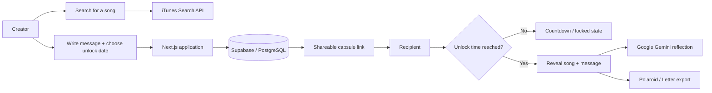

# SlowJam — Music-Driven Time Capsule Web App

**Send a song to the future.**

SlowJam is a full-stack web application for creating digital time capsules around music. A user chooses a song, writes a personal message, sets an unlock date, and shares the capsule with someone. The recipient can open the link immediately, but the content remains locked until the chosen date.

**Live:** https://slowjam.xyz/

## Why I Built It

SlowJam started as a side project exploring how music, anticipation, and personal messages could be combined into a simple shareable experience. After launch, a Threads post about the project reached a large audience and drove real production traffic into the application.

### Launch Results

- **6.5K+ visitors**
- **25K+ page views in one week**
- **1,500+ capsules created during the initial surge**
- **865 different songs used**
- **205 anonymous email sends**
- The platform later passed **1,800 user-created capsules**

These figures were recorded from the project's launch period and subsequent usage updates.

## Product Flow



## Architecture & Technology

**Frontend / Application**
- Next.js
- React
- TypeScript
- Tailwind CSS
- Framer Motion

**Backend / Data**
- Next.js server routes
- Supabase
- PostgreSQL
- Supabase Auth

**Integrations**
- iTunes Search API for music search and previews
- Google Gemini for AI-generated reflections after a capsule is opened
- Resend for email delivery workflows
- Vercel Analytics and Speed Insights

**Deployment**
- Vercel

## Key Features

- Create time-locked music capsules with a song, message, sender/recipient details, and unlock date.
- Search songs through the iTunes Search API with preview audio and artwork.
- Generate shareable capsule links without requiring the recipient to create an account.
- Optional account support for history, favorites, and managing capsules.
- AI-generated post-unlock reflections using Google Gemini.
- Anonymous email delivery for selected capsules.
- Export opened memories in Polaroid and Letter-style formats.
- Public/private capsule controls and usage statistics.

## Production Incident & Recovery

The first public release used Spotify for song search. When unexpected traffic arrived after the project gained attention, the original music integration became a production dependency problem.

I replaced the Spotify integration with the **iTunes Search API** and redeployed the application in less than 24 hours. The migration removed the previous OAuth dependency while keeping the frontend data contract largely unchanged, allowing the product to recover quickly without a full UI rewrite.

That incident became one of the most useful parts of the project: it forced a real-world architecture decision around third-party dependency risk, compatibility, reliability, and fast recovery.

## Project Ownership

I created the product concept, user experience, feature requirements, system behavior, integration decisions, and overall technical direction. AI-assisted development tools were used to accelerate parts of implementation, while I remained responsible for the product decisions, architecture choices, debugging, integration, testing, deployment, and iteration.

## Repository Structure

The application is located under:

```text
song-capsule/
├── app/            # Next.js pages, components and API routes
├── lib/            # Shared application / Supabase utilities
├── public/         # Static assets
├── package.json
└── vercel.json
```

## Run Locally

```bash
cd song-capsule
npm install
npm run dev
```

Create the required environment variables locally before running features that depend on Supabase, Gemini, email, or other external services.

## Notes

This repository documents the engineering evolution of SlowJam, including the migration away from the original Spotify-based implementation. Some older filenames or comments may still reference Spotify for compatibility/history even though current song search is powered by iTunes.

---

Built and maintained by **Afiq Amri**.
